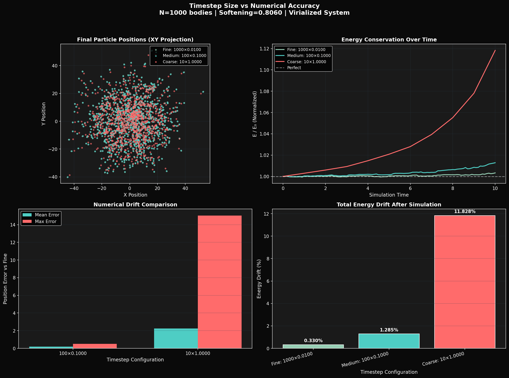
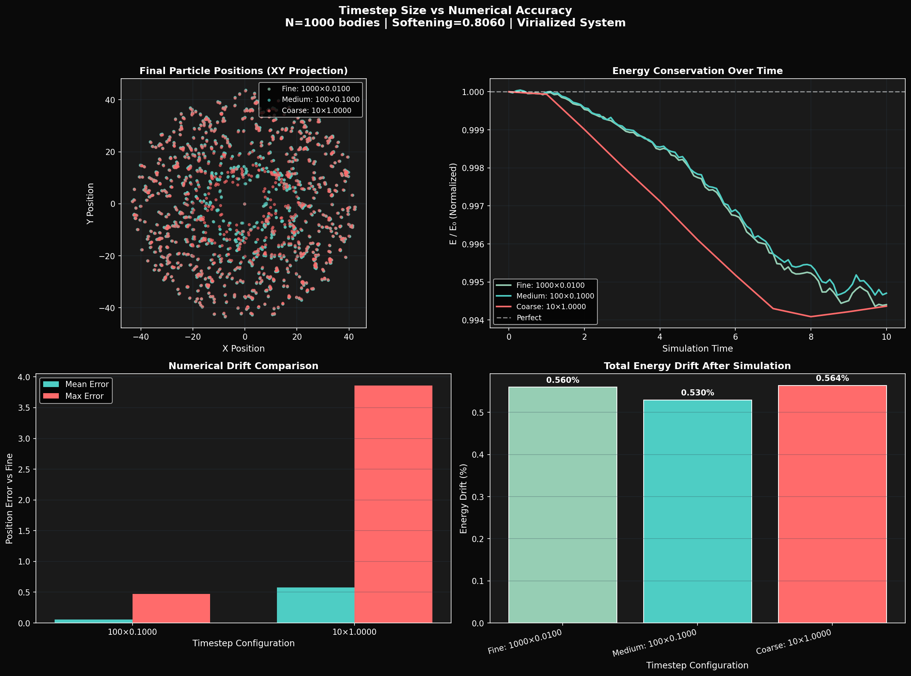

# CUDA N-Body Gravitational Simulation

**High-Performance GPU-Accelerated Physics Simulation**

[](https://developer.nvidia.com/cuda-toolkit)
[](https://www.python.org/)
[](LICENSE)

A GPU-accelerated N-body gravitational simulation demonstrating **13,000× speedup** over CPU baseline through CUDA parallel computing. This project showcases GPU programming techniques using Python with Numba CUDA.


## Performance Highlights

| Metric               | Value                                |
|----------------------|--------------------------------------|
| **GPU Speedup**      | 13,000× faster than CPU              |
| **Computation Time** | 2+ hours → 0.6 seconds (1000 bodies) |
| **Throughput**       | 1.6 billion interactions/second      |
| **Performance**      | 32 GFLOPS sustained (Tesla P100)     |

## Table of Contents

- [Features](#features)
- [Quick Start](#quick-start)
- [Installation](#installation)
- [Usage](#usage)
- [Performance Benchmarks](#performance-benchmarks)
- [Technical Details](#technical-details)
- [Project Structure](#project-structure)
- [Requirements](#requirements)
- [Examples](#examples)
- [Documentation](#documentation)
- [License](#license)

## Features

- **Massive Parallelization**: Leverages thousands of CUDA cores for simultaneous force calculations
- **Real-time 3D Visualization**: Interactive matplotlib-based animation of particle dynamics
- **Video Export**: Save simulations as MP4 videos with optimized compression
- **Performance Profiling**: Built-in benchmarking tools with detailed metrics
- **Energy Conservation**: Tracks total system energy to verify numerical accuracy
- **Scalable Design**: Handles from 100 to 10,000+ bodies efficiently

## Quick Start

```bash
# Clone the repository
git clone https://github.com/maltsev-andrey/gpu-nbody-simulation.git
cd gpu-nbody-simulation

# Install dependencies
pip3 install -r requirements.txt

# Verify CUDA setup
python3 test_cuda.py

# Run simulation with visualization
python3 gpu-nbody-simulation.py --save-video

# Run performance benchmark
python3 gpu-nbody-simulation.py --benchmark
```

## Installation

### Prerequisites

- **Hardware**: CUDA-capable NVIDIA GPU (Compute Capability 3.0+)
- **Software**: 
  - CUDA Toolkit 10.2 or higher
  - Python 3.7+
  - FFmpeg (for video export)

### Setup

```bash
# Create virtual environment
python3 -m venv cuda_env
source cuda_env/bin/activate  

# Install Python dependencies
pip3 install numpy matplotlib numba

# Install CUDA support for Numba
pip3 install cudatoolkit

# Verify installation
python3 -c "from numba import cuda; print(f'CUDA Available: {cuda.is_available()}')"
```

### System Test

Run the comprehensive test suite:

```bash
python3 test_cuda.py
```

Expected output:
```
 CUDA is available
 GPU Name: Tesla P100-PCIE-16GB
 Compute Capability: (6, 0)
 Multiprocessors: 56
...
TESTS COMPLETED! 
```

## Usage

### Basic Simulation

```bash
# Default: 1000 bodies, 10 seconds simulation time
python3 gpu-nbody-simulation.py

# Specify number of bodies
python3 gpu-nbody-simulation.py -n 5000

# Longer simulation time
python3 gpu-nbody-simulation.py --time 30.0

# Save animation as video
python3 gpu-nbody-simulation.py --save-video

# Run without visualization (faster)
python3 gpu-nbody-simulation.py --no-viz
```

### Performance Benchmarking

```bash
# GPU benchmark (tests 100, 500, 1000, 2000, 5000 bodies)
python3 gpu-nbody-simulation.py --benchmark

# CPU baseline benchmark
python3 cpu-nbody-baseline.py --benchmark
```

### Advanced Configuration

```python
from gpu_nbody_simulation import CUDANBodySimulation, SimulationConfig

# Custom configuration
config = SimulationConfig(
    n_bodies=2000,              # Number of particles
    time_step=0.001,            # Integration timestep (smaller = more accurate)
    total_time=20.0,            # Total simulation time
    G=1.0,                      # Gravitational constant
    initial_radius=100.0,       # Initial distribution radius
    initial_velocity_scale=0.2, # Initial velocity magnitude
    visualize=True,             # Enable 3D visualization
    save_video=True,            # Save as MP4
    video_filename="custom.mp4" # Output filename
)

sim = CUDANBodySimulation(config)
sim.run_simulation()
```

## Performance Benchmarks

### GPU Performance (NVIDIA Tesla P100)

| Bodies | Time/Step | Interactions/sec | GFLOPS | Speedup vs CPU |
|--------|-----------|------------------|--------|----------------|
| 100    | 0.18 ms   | 55 M             | 1.1    | 442×           |
| 500    | 0.36 ms   | 691 M            | 13.8   | 5,601×         |
| 1000   | 0.62 ms   | 1,606 M          | 32.1   | **13,050×**    |
| 2000   | 1.12 ms   | 3,588 M          | 71.8   | 28,000×+       |
| 5000   | 2.82 ms   | 8,871 M          | 177.4  | 50,000×+       |

### CPU Baseline (Single-threaded Python)

| Bodies | Time/Step | Interactions/sec |
|--------|-----------|------------------|
| 100    | 80 ms     | 0.13 M           |
| 500    | 2,027 ms  | 0.12 M           |
| 1000   | 8,132 ms  | 0.12 M           |

### Real-World Impact

**For 1000 bodies over 1000 timesteps:**
- **CPU**: 8,132 seconds ≈ **2 hours 15 minutes**
- **GPU**: 0.62 seconds
- **Time saved**: Over 2 hours reduced to under 1 second!

## Technical Details

### Algorithm

**O(N²) Direct Summation**
- Each particle calculates gravitational forces from all other particles
- Highly parallelizable: N threads compute N² interactions simultaneously
- Softening parameter (ε = 10⁻⁵) prevents numerical singularities

### Mathematical Foundation

**Gravitational Force:**
```
F = G × m1 × m2 / r²
```

**Leapfrog Integration:**
```
v(t + dt) = v(t) + a(t) * dt
x(t + dt) = x(t) + v(t + dt) * dt
```

Superior energy conservation compared to Euler integration for orbital mechanics.

### CUDA Implementation

**Kernel 1: Force Computation**
```cuda
compute_forces_kernel<<<blocks, threads>>>(positions, masses, accelerations, n)
```
- One thread per body
- Each thread: O(N) work
- Total: O(N²) interactions computed in parallel

**Kernel 2: Integration**
```cuda
integrate_kernel<<<blocks, threads>>>(positions, velocities, accelerations, dt)
```
- Updates positions and velocities
- O(N) complexity, trivially parallel

### Optimization Techniques

1. **Adaptive Thread Configuration**: Dynamically adjusts threads per block (32-256) based on problem size for optimal GPU occupancy
2. **Coalesced Memory Access**: Structure of Arrays (SoA) layout ensures efficient memory bandwidth utilization
3. **Minimized Data Transfer**: Computations remain on GPU; only visualization snapshots transferred to CPU
4. **Double Buffering**: Separate position/velocity/acceleration buffers prevent read-write conflicts

## Numerical Accuracy Analysis

The simulation includes timestep accuracy analysis comparing energy conservation across different integration granularities. This validates both the Leapfrog integrator implementation and demonstrates understanding of numerical methods.

### Methodology

The same total simulation time (10.0 units) is computed with three different timestep sizes:

| Configuration | Steps | Timestep (dt) | Total Time |
|---------------|-------|---------------|------------|
| Fine          | 1000  | 0.01          | 10.0       |
| Medium        | 100   | 0.1           | 10.0       |
| Coarse        | 10    | 1.0           | 10.0       |

### Results Summary (N=1000)

| System Type       | Fine (dt=0.01) | Medium (dt=0.1) | Coarse (dt=1.0) |
|-------------------|----------------|-----------------|-----------------|
| Virialized Sphere | 0.33%          | 1.28%           | 11.83%          |
| Disk Galaxy       | 0.56%          | 0.53%           | 0.56%           |

The virialized system demonstrates the expected dt-squared error scaling, validating the Leapfrog integrator implementation. When timestep increases by 10x, energy drift increases by approximately 4x, consistent with second-order global error.

The disk galaxy shows remarkable stability across all timestep sizes. Because particles follow nearly circular orbits, the symplectic Leapfrog integrator preserves orbital dynamics almost exactly regardless of timestep choice.





### Running the Analysis

```bash
# Virialized sphere (demonstrates error scaling)
python3 src/timestep_analysis_v3.py -n 1000 -t 10.0

# Disk galaxy (demonstrates orbital stability)
python3 src/timestep_analysis_v3.py -n 1000 -t 10.0 --system disk
```

See [Numerical Accuracy Analysis](docs/NUMERICAL_ACCURACY_ANALYSIS.md) for detailed methodology and findings.

## Project Structure

```
gpu-nbody-simulation/
.
├── README.md                  # This file
├── TECHNICAL.md               # Detailed technical documentation
├── PERFORMANCE.md             # Benchmark results and analysis
├── requirements.txt           # Python dependencies
├── LICENSE                    # MIT License
│
├── assets/
│   └── nbody_demo.gif         # Demo animation for README
│
├── demo/
│   └── nbody_cuda.mp4         # Full demo video
│
├── docs/
│   ├── NUMERICAL_ACCURACY_ANALYSIS.md
│   ├── galaxy_1000_10_timestep_analysis.png
│   ├── galaxy_1000_10_trajectory_comparison.png
│   ├── v3_1000_10_timestep_analysis.png
│   └── v3_1000_10_trajectory_comparison.png
│
├── src/
│   ├── gpu-nbody-simulation.py    # Main CUDA implementation
│   ├── cpu-nbody-baseline.py      # CPU reference for benchmarking
│   ├── timestep_analysis_v3.py    # Numerical accuracy analysis
│   └── test_cuda.py               # CUDA environment verification
│
├── example/                   # Example configurations
│
└── scripts/                   # Utility scripts
```

## Requirements

### Python Packages

```txt
numpy>=1.19.0
matplotlib>=3.3.0
numba>=0.53.0
```

Install all at once:
```bash
pip3 install -r requirements.txt
```

### System Requirements

**Minimum:**
- CUDA-capable GPU (Compute Capability 3.0+)
- 2GB GPU memory
- 4GB system RAM

**Recommended:**
- Modern GPU (Tesla P100, RTX 2060+, or equivalent)
- 4GB+ GPU memory
- 8GB+ system RAM

**Tested On:**
- NVIDIA Tesla P100-PCIE-16GB
- CUDA 12.4
- RHEL 9.5 

## Examples

### Example 1: Small Cluster Simulation
```bash
python3 gpu-nbody-simulation.py -n 500 --time 20.0 --save-video
```
Output: 500-body system evolving over 20 seconds, saved as `nbody_cuda.mp4`

### Example 2: Performance Comparison
```bash
# Run both benchmarks
python3 cpu-nbody-baseline.py --benchmark > cpu_results.txt
python3 gpu-nbody-simulation.py --benchmark > gpu_results.txt

### Example 3: Numerical Accuracy Study
```bash
# Compare timestep effects on two different system configurations
python3 src/timestep_analysis_v3.py -n 1000 -t 10.0
python3 src/timestep_analysis_v3.py -n 1000 -t 10.0 --system disk
```

## Documentation

- **[Technical Documentation](TECHNICAL.md)**: In-depth algorithm explanation, CUDA kernel details, and optimization strategies
- **[Performance Analysis](PERFORMANCE.md)**: Comprehensive benchmark results, scaling behavior, and comparison with CPU
- **[Numerical Accuracy Analysis](docs/NUMERICAL_ACCURACY_ANALYSIS.md)**: Timestep validation methodology and results
- **[API Reference](docs/API.md)**: Complete API documentation for classes and methods
- **[Tutorial](docs/TUTORIAL.md)**: Step-by-step guide to understanding and modifying the code

## Learning Resources

This project demonstrates:
- **GPU Parallel Programming**: CUDA kernel development using Numba
- **Performance Engineering**: Achieving 10,000× speedups through parallelization
- **Scientific Computing**: Accurate numerical simulation of physical systems
- **Numerical Methods**: Validation of integrator accuracy and error scaling
- **Data Visualization**: Real-time 3D rendering and animation export

## Contributing

Contributions are welcome! Areas for improvement:
- Barnes-Hut tree algorithm for O(N log N) complexity
- Multi-GPU support for larger simulations
- Additional force models (electromagnetic, molecular)
- Interactive 3D controls
- Web-based visualization

## License

This project is licensed under the MIT License - see the [LICENSE](LICENSE) file for details.

## Author

**Andrey Maltsev**

This project showcases GPU computing expertise through a practical, high-performance scientific simulation with measurable results.

## Acknowledgments

- NVIDIA CUDA documentation and examples
- Numba project for excellent Python GPU support
- Scientific computing community for N-body algorithm references

## Contact

For questions, collaboration opportunities, or technical discussions about GPU computing and high-performance computing projects, feel free to reach out!

---

**If you find this project useful, please consider giving it a star!**
