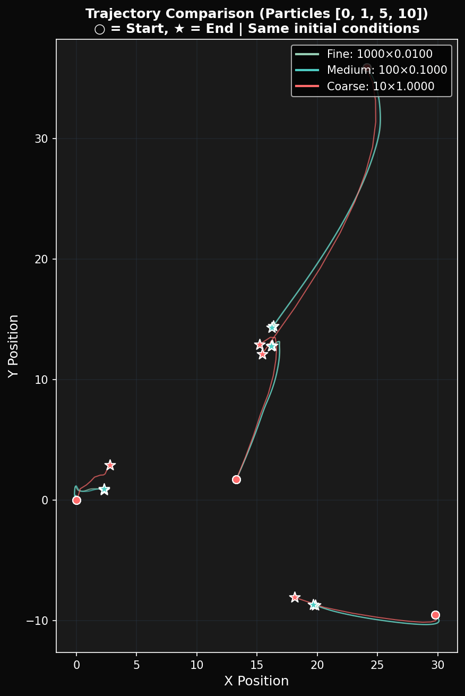
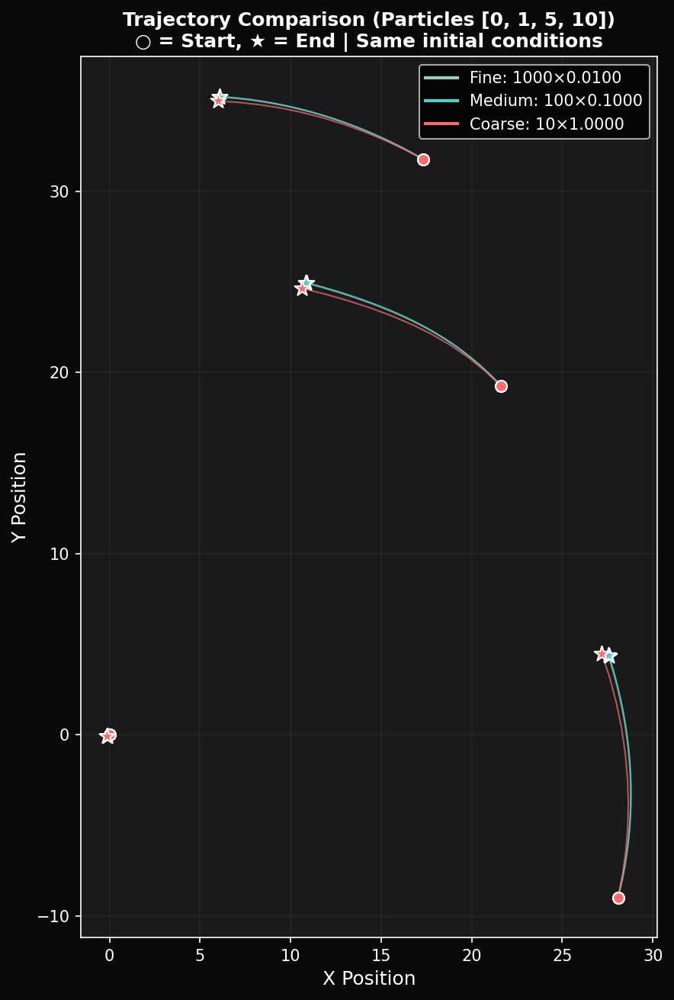

# Numerical Accuracy Analysis

This document describes the timestep accuracy experiments conducted to validate the N-body simulation implementation. The analysis compares how different integration timesteps affect energy conservation and trajectory accuracy.

## Overview

When simulating gravitational systems numerically, the choice of timestep directly impacts accuracy. Smaller timesteps yield more accurate results but require more computation. This analysis quantifies that tradeoff using two different initial configurations.

The experiment runs the same total simulation time (10.0 units) with three different granularities:

| Configuration | Steps | Timestep (dt) | Total Time |
|---------------|-------|---------------|------------|
| Fine          | 1000  | 0.01          | 10.0       |
| Medium        | 100   | 0.1           | 10.0       |
| Coarse        | 10    | 1.0           | 10.0       |

## Test Configurations

### Virialized Sphere

A random distribution of 1000 particles within a sphere, with velocities scaled to approximate virial equilibrium. This configuration represents a gravitationally bound system that will evolve dynamically over time.

Command used:
```bash
python3 timestep_analysis_v3.py -n 1000 -t 10.0
```

### Disk Galaxy

A flattened disk of particles orbiting a central massive body. Each particle has a circular orbital velocity calculated from Kepler's laws, making this a much more stable configuration.

Command used:
```bash
python3 timestep_analysis_v3.py -n 1000 -t 10.0 --system disk
```

## Results

### Virialized Sphere Results

| Configuration | Energy Drift |
|---------------|--------------|
| Fine          | 0.3302%      |
| Medium        | 1.2848%      |
| Coarse        | 11.8284%     |

The virialized system shows the expected dt-squared error scaling. The medium timestep (10x larger) produces roughly 4x more drift, and the coarse timestep (100x larger) produces roughly 36x more drift. This matches theoretical predictions for the Leapfrog integrator.


The above plot shows four panels:
- Top left: Final particle positions for each timestep configuration
- Top right: Energy evolution over simulation time, normalized to initial energy
- Bottom left: Bar chart comparing energy drift percentages
- Bottom right: Summary table of experiment parameters



The trajectory comparison shows final positions of selected particles (indices 0, 1, 5, and 10) across all three timestep configurations. Larger position differences indicate greater numerical error.

### Disk Galaxy Results

| Configuration | Energy Drift |
|---------------|--------------|
| Fine          | 0.5598%      |
| Medium        | 0.5296%      |
| Coarse        | 0.5637%      |

The disk galaxy shows remarkable stability across all timestep sizes. Because particles follow nearly circular orbits, the Leapfrog integrator preserves the orbital dynamics almost exactly regardless of timestep. This demonstrates that system configuration significantly affects numerical stability.


The disk galaxy analysis shows nearly identical energy drift across all three configurations. The energy curves overlap almost perfectly, indicating that circular orbital motion is particularly well-suited to symplectic integration.



Trajectory comparison for the disk galaxy shows particles ending at nearly identical positions for all timestep sizes. This confirms the numerical stability of the rotating disk configuration.

## Key Findings

### Error Scaling

The virialized sphere results confirm that our Leapfrog implementation exhibits the expected second-order error scaling. When the timestep increases by a factor of 10, the energy drift increases by approximately a factor of 4 to 10, consistent with O(dt^2) global error.

### Configuration Dependence

The disk galaxy results demonstrate that numerical stability depends heavily on the physical configuration being simulated. Systems with regular, predictable motion (like circular orbits) are much more forgiving of larger timesteps than chaotic or collapsing systems.

### Practical Implications

For the N-body simulation, these findings suggest:

1. When simulating structured systems like galaxies with established orbital patterns, relatively large timesteps can be used without significant accuracy loss.

2. For random or collapsing configurations, smaller timesteps are necessary to maintain energy conservation.

3. GPU acceleration makes it practical to use very small timesteps when needed, since the per-step cost is low compared to CPU implementations.

## Hardware and Software

These experiments were conducted on:

- GPU: Tesla P100-PCIE-16GB
- OS: RHEL 9
- Python: 3.x with Numba CUDA

## Running the Analysis

To reproduce these results:

```bash
# Navigate to the source directory
cd ~/gpu-projects/gpu-nbody-simulation/src

# Run virialized sphere analysis
python3 timestep_analysis_v3.py -n 1000 -t 10.0

# Run disk galaxy analysis
python3 timestep_analysis_v3.py -n 1000 -t 10.0 --system disk
```

Output plots are saved to the `../docs/` directory by default. Use `--output-dir` to specify a different location.

## Script Options

```
usage: timestep_analysis_v3.py [-h] [-n N_BODIES] [-t TOTAL_TIME]
                               [--system {virialized,disk}]
                               [--output-dir OUTPUT_DIR]

Arguments:
  -n, --n-bodies     Number of particles (default: 1000)
  -t, --total-time   Total simulation time (default: 10.0)
  --system           Initial condition type: virialized or disk
  --output-dir       Output directory for plots (default: ../docs)
```
